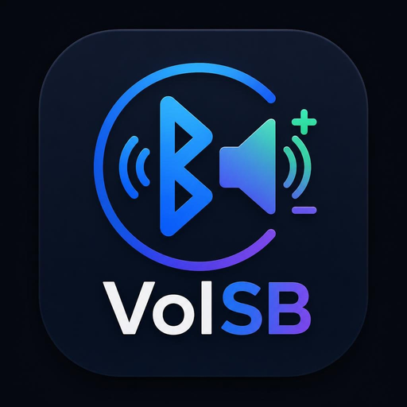

<p align="center">
  
</p>

<h1 align="center">VolSB</h1>

<p align="center">
  <strong>Control avanzado de volumen Bluetooth para Android</strong><br/>
  Amplificadores · DACs · Speakers · Headsets
</p>

<p align="center">
  
  
  
  
</p>

---

## ¿Qué problema resuelve?

Cuando **Absolute Volume (AVRCP)** falla, el volumen de Android y el volumen interno del dispositivo Bluetooth se desconectan. Tu amplificador o DAC queda en silencio aunque Android marque volumen alto.

```
 Android              Dispositivo BT
┌──────────┐         ┌──────────────┐
│ Vol: 80% │◄──────► │ Vol interno  │
└──────────┘  AVRCP  │ puede ser 0% │
              roto   └──────────────┘
```

**VolSB lo soluciona** usando `FLAG_BLUETOOTH_ABS_VOLUME` para forzar que Android propague cada cambio de volumen al dispositivo vía AVRCP, renotificando al stack BT y guiando al usuario paso a paso.

---

## Funciones principales

| Función | Descripción |
|---------|-------------|
| 🎚️ **Volumen dual** | Slider de sistema Android + botones AVRCP independientes |
| 🔄 **Resincronizar** | Bump max→actual para re-notificar al stack BT |
| 🔌 **Reconectar** | Desconecta y reconecta el perfil A2DP automáticamente |
| 🔇 **Mute / Unmute** | Vía AVRCP + AudioManager |
| 🔊 **Reset BT Vol** | Lleva al 50% y resincroniza |
| 🆘 **Recuperar Mute** | Burst de 8 comandos VOLUME_UP + unmute + resync |
| ⚙️ **Absolute Volume** | Toggle bluetooth_avrc_absolute_vol (requiere ADB) |
| 💾 **Perfiles** | Guarda configuración preferida por dispositivo |
| 🎨 **Tema** | Oscuro premium por defecto, claro disponible, fondo personalizable |

---

## Stack técnico

| Capa | Tecnología |
|------|-----------|
| UI / UX | Flutter 3 + Dart · Material 3 |
| Lógica nativa | Kotlin (Android) |
| Bridge | Platform Channels (MethodChannel) |
| Estado | ChangeNotifier + Provider |
| Almacenamiento | SharedPreferences |

```
Flutter (UI/UX)
      ↓  Platform Channel: com.btvolumepro/bluetooth
Kotlin Android Native
      ↓
Bluetooth APIs (A2DP · AVRCP) + AudioManager (FLAG_BLUETOOTH_ABS_VOLUME)
```

---

## Requisitos

| Requisito | Versión mínima |
|-----------|---------------|
| Flutter SDK | 3.41+ (canal stable) |
| Android SDK | API 23+ (Android 6.0) |
| Kotlin | 2.1+ |
| Java JDK | 21+ |

---

## Instalación y ejecución

```bash
# 1. Clona el repositorio
git clone https://github.com/JuanEstebanHerreraH/VolSB.git
cd VolSB

# 2. Instala dependencias
flutter pub get

# 3. Conecta un dispositivo Android físico (el emulador no tiene BT real)
flutter devices

# 4. Ejecuta en modo debug
flutter run

# 5. Compila APK de release
flutter build apk --release
# APK en: build/app/outputs/flutter-apk/app-release.apk
```

---

## Permiso especial: WRITE_SECURE_SETTINGS

Para activar/desactivar **Absolute Volume** sin root, otorga el permiso vía ADB una sola vez:

```bash
adb shell pm grant com.btvolumepro.app android.permission.WRITE_SECURE_SETTINGS
```

> Sin este permiso la app funciona igualmente. Solo se pierde la capacidad de forzar Absolute Volume. Todas las demás funciones siguen disponibles.

---

## Permisos Android

| Permiso | Propósito |
|---------|-----------|
| BLUETOOTH_CONNECT | Conectar dispositivos (Android 12+) |
| BLUETOOTH_SCAN | Detectar dispositivos cercanos |
| BLUETOOTH / BLUETOOTH_ADMIN | Android 11 y anteriores |
| MODIFY_AUDIO_SETTINGS | Controlar volumen del sistema |
| MEDIA_CONTENT_CONTROL | Comandos de medios / AVRCP |
| ACCESS_FINE_LOCATION | BT scan en Android 10 y anteriores |
| READ_MEDIA_IMAGES | Imagen de fondo personalizada |
| WRITE_SECURE_SETTINGS | Toggle Absolute Volume (vía ADB) |

---

## Arquitectura

```
volsb/
├── lib/
│   ├── main.dart
│   ├── app.dart
│   ├── theme/app_theme.dart
│   ├── models/
│   │   ├── bt_device.dart
│   │   └── device_profile.dart
│   ├── providers/app_state.dart
│   ├── services/
│   │   ├── bt_channel_service.dart
│   │   └── profile_service.dart
│   ├── screens/
│   │   ├── home_screen.dart
│   │   ├── settings_screen.dart
│   │   └── help_screen.dart
│   └── widgets/
│       ├── device_card.dart
│       ├── volume_panel.dart
│       ├── quick_actions_bar.dart
│       ├── status_banner.dart
│       └── no_device_view.dart
│
├── android/app/src/main/
│   ├── kotlin/com/btvolumepro/app/
│   │   ├── MainActivity.kt
│   │   ├── BluetoothVolumeManager.kt
│   │   └── AVRCPController.kt
│   └── AndroidManifest.xml
│
├── assets/images/logo.png
└── pubspec.yaml
```

---

## Notas técnicas

**¿Por qué `FLAG_BLUETOOTH_ABS_VOLUME` (64)?**
Android tiene dos comportamientos al llamar `setStreamVolume`:
- Flag `0` — cambia el volumen local de Android, pero **no notifica al dispositivo BT**.
- Flag `64` — cambia el volumen local **y** envía la notificación AVRCP al dispositivo, actualizando su volumen interno.

Sin este flag, el amp o DAC nunca recibe el cambio y queda muteado aunque Android marque volumen alto. VolSB usa `64` en todas las operaciones de volumen para garantizar la propagación.

---

## Licencia

MIT – Libre para uso personal y comercial.
